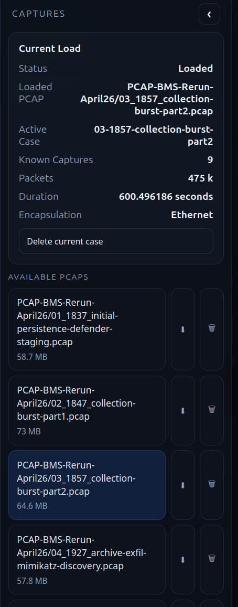
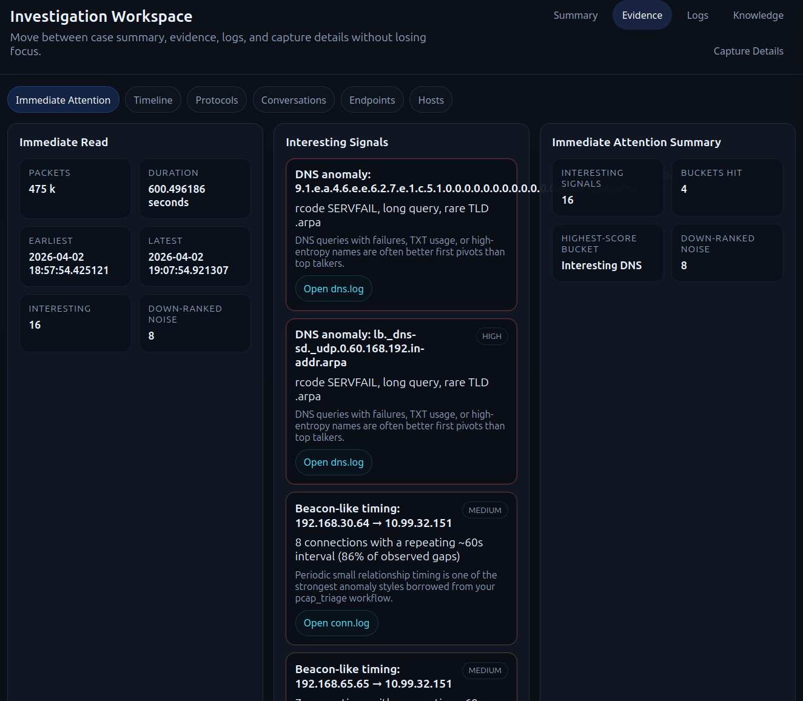
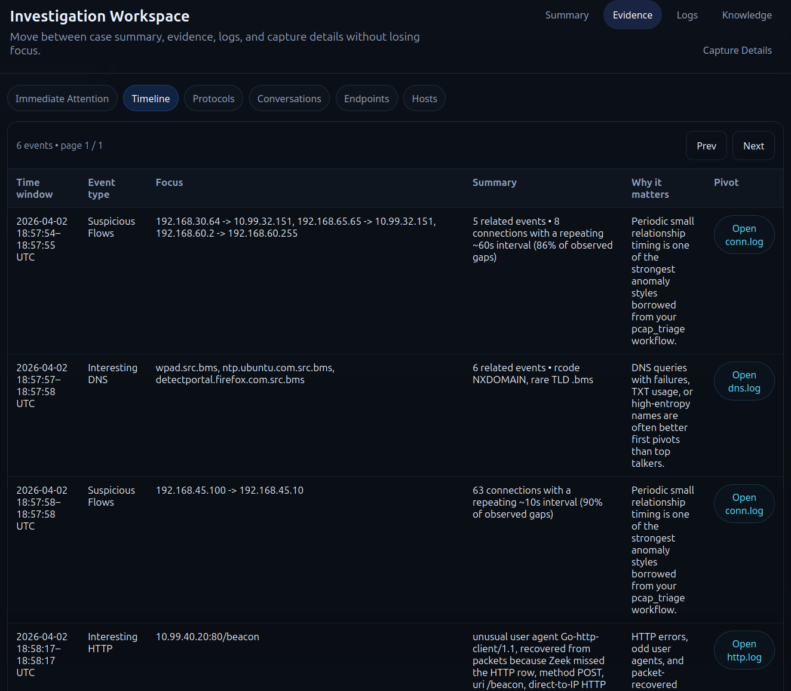
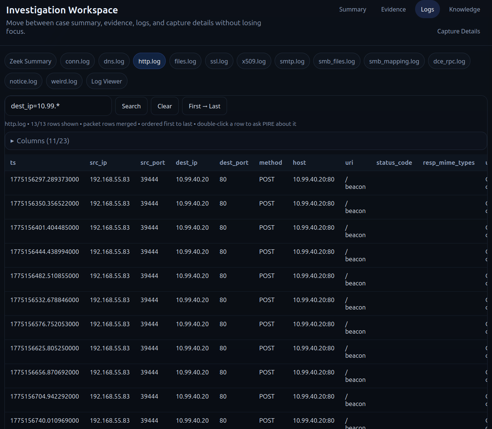
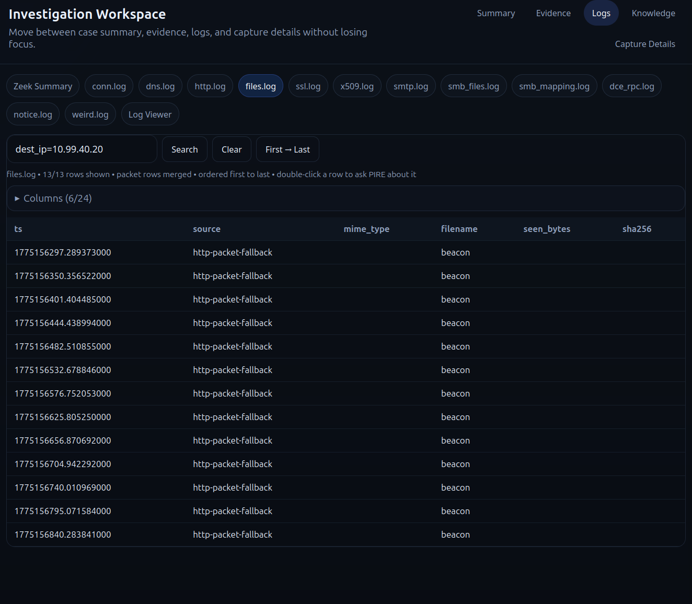
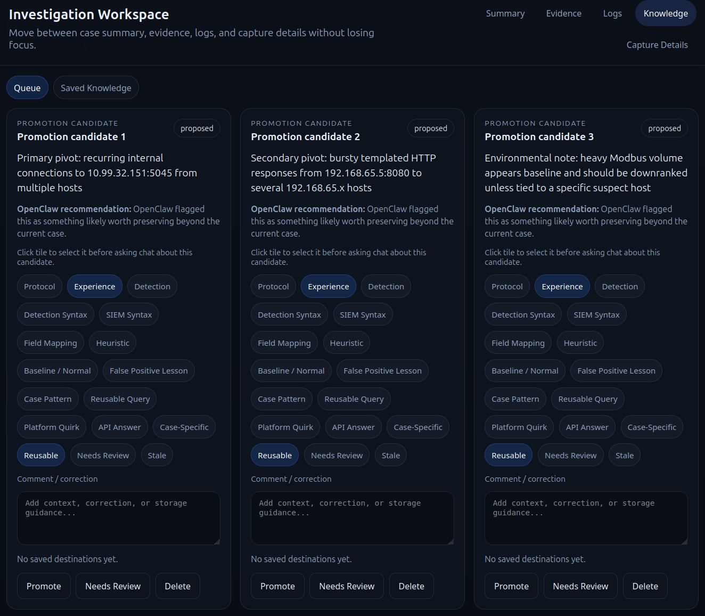
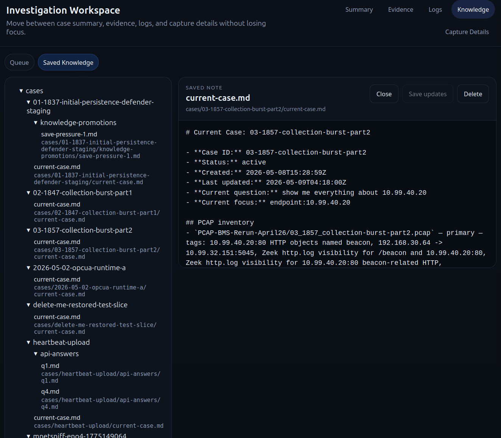
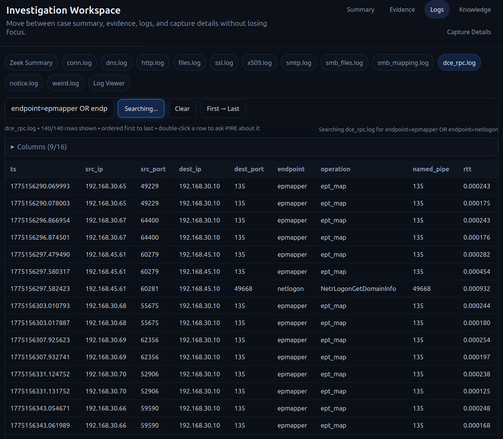

# PIRE

**PCAP Ingest, Read & Evaluate**

PIRE is a container-first PCAP investigation workbench.

It is built for the stage **before** detection writing: loading a capture, preserving packet-grounded truth, pivoting through evidence, exploring Zeek logs, comparing Zeek output with packet truth, and using an OpenClaw-backed chat lane without losing the actual investigation context.

OpenClaw is the reasoning participant.
PIRE is the packet workbench, evidence surface, and pivot engine.

---

## What PIRE is for

PIRE is meant to help with two closely related jobs:

1. **Find items of interest in an unfamiliar PCAP**
2. **Interrogate a known PCAP carefully before writing detections**

That means PIRE is optimized for:

- packet-grounded investigation
- Wireshark / tshark fidelity
- Zeek-backed browsing without over-trusting Zeek
- fast endpoint / host / conversation pivots
- timeline-aware review
- repeatable case state
- controlled knowledge capture instead of auto-saving everything

PIRE is **not** trying to replace Wireshark.
It is also **not** trying to be a generic chatbot shell with a PCAP file attached.

---

## Current status

PIRE is early, but it is a real working workbench now.

Current validated capabilities include:

- Dockerized runtime with tshark, capinfos, tcpdump, Zeek, zeek-cut, zkg
- CLI for ingest, summary, pair pivots, frame pivots, exports, and runtime scaffolding
- Browser UI on port `22000`
- PCAP upload / load management
- Investigation workspace with summary, evidence, logs, knowledge, and capture-details tabs
- OpenClaw-backed case chat
- IP dossier and case-state persistence
- Knowledge queue and saved-knowledge editing
- Direct PCAP download from the sidebar
- Screenshot / pasted-image chat attachments
- Boolean Zeek log search with alias fields like `src_ip`, `dest_ip`, `src_port`, `dest_port`
- Packet-derived fallback / merged log surfacing when Zeek misses things
- Millisecond `pcap_offset_ms` / `pcap_offset_s` sequencing for merged Zeek + packet-derived rows

---

## Core design rules

These rules matter more than any individual feature:

- **Packet truth beats pretty summaries.**
- **Zeek is a strong parallel lane, not a replacement for packet evidence.**
- **Wireshark / tshark frame fidelity should be preserved whenever possible.**
- **PIRE should help investigate first, not jump straight to detections.**
- **Knowledge capture should be deliberate, not spammy.**
- **Case-local observations and durable reusable knowledge are not the same thing.**

---

## Mental model: Ingest / Read / Evaluate

PIRE operates in three layers:

- **Ingest** — validate and inventory the capture
- **Read** — extract packet-grounded summaries and nearby context
- **Evaluate** — answer the actual investigative question

The UI may feel conversational, but under the hood PIRE still needs to ingest and read before it can evaluate well.

---

## Architecture in one page

### Host responsibilities

The host should need as little as possible:

- Docker Engine
- Docker Compose plugin
- a reachable OpenClaw-compatible API endpoint
- a bearer token for that endpoint

### Container responsibilities

The container carries the packet tooling:

- tshark / Wireshark CLI tools
- capinfos
- editcap / mergecap
- tcpdump
- Zeek
- zeek-cut
- zkg
- Python app runtime

### Runtime split

- **OpenClaw** provides reasoning / chat behavior
- **PIRE** provides packet state, evidence pivots, Zeek views, case memory, and operator workflow

---

## Repository layout

```text
src/pire/                Python package / CLI / web app
pire/incoming/           incoming PCAPs
pire/output/             normalized outputs and metadata
pire/exports/            cut PCAPs and exports
pire/cache/              intermediate caches, including Zeek caches
library/                 runtime knowledge + case workspace
config/                  future configuration
docker/                  entrypoint/helpers
docs/                    design and implementation notes
templates/               runtime note templates
examples/                examples and experiments
```

Important runtime tree:

```text
library/
  protocols/
  experience/
  cases/
    case-index.json
    <case-id>/
      current-case.md
      case-state.json
      knowledge-links.json
      api-answers/
```

---

## Host setup (Ubuntu 24.04 example)

### 1) Install Docker and Compose plugin

```bash
sudo apt-get update && sudo apt-get install -y ca-certificates curl gnupg
sudo install -m 0755 -d /etc/apt/keyrings
curl -fsSL https://download.docker.com/linux/ubuntu/gpg | sudo gpg --dearmor -o /etc/apt/keyrings/docker.gpg
echo "deb [arch=$(dpkg --print-architecture) signed-by=/etc/apt/keyrings/docker.gpg] https://download.docker.com/linux/ubuntu $(. /etc/os-release && echo $VERSION_CODENAME) stable" | sudo tee /etc/apt/sources.list.d/docker.list > /dev/null
sudo apt-get update
sudo apt-get install -y docker-ce docker-ce-cli containerd.io docker-buildx-plugin docker-compose-plugin
```

### 2) Allow your user to access Docker

```bash
sudo usermod -aG docker "$USER"
```

Then either log out and back in, or start a new shell:

```bash
newgrp docker
```

### 3) Verify Docker works

```bash
docker --version
docker compose version
docker ps
```

---

## Clone and enter the repo

```bash
git clone https://github.com/Pb-22/PIRE.git
cd PIRE
```

---

## Configure OpenClaw access

PIRE expects an OpenClaw-compatible chat backend.

Create a local `.env` file from the example:

```bash
cp .env.example .env
```

Then edit `.env` and set at least:

```dotenv
PIRE_OPENCLAW_API_BASE=http://127.0.0.1:18789/v1
PIRE_OPENCLAW_API_KEY=<your-gateway-token>
PIRE_OPENCLAW_MODEL=openclaw/default
```

### Security note

- `.env` contains real credentials and **must not be committed**
- this repo’s `.gitignore` excludes `.env`
- if you publish examples or screenshots, do not leak your token in environment dumps or browser developer tools

---

## Build and start

Build the image:

```bash
docker compose build
```

Start the browser UI:

```bash
docker compose up -d pire-ui
```

Open:

```text
http://localhost:22000
```

By default, the UI binds to loopback only.

If PIRE is on a remote host, tunnel it instead of opening it broadly:

```bash
ssh -L 22000:127.0.0.1:22000 <user>@<server>
```

Then browse locally to:

```text
http://localhost:22000
```

---

## Basic validation

CLI doctor:

```bash
docker compose run --rm pire pire doctor
```

UI health:

```bash
curl http://127.0.0.1:22000/healthz
```

Expected key tools inside the container:

- `tshark`
- `capinfos`
- `editcap`
- `mergecap`
- `tcpdump`
- `zeek`
- `zeek-cut`
- `zkg`

---

## Quick start workflow

### 1) Put PCAPs in the incoming folder

```text
pire/incoming/
```

### 2) Start the UI

```bash
docker compose up -d pire-ui
```

### 3) Load a PCAP in the browser

Use the sidebar to load a capture.

### 4) Work through the tabs

Typical flow:

- **Summary** for orientation
- **Evidence** for fast pivots and timeline review
- **Logs** for Zeek / merged log review
- **Chat** for case-grounded questions
- **Knowledge** only when something truly deserves preservation

---

## CLI commands

Current CLI surface:

```bash
docker compose run --rm pire pire --help
```

Available commands currently include:

- `doctor`
- `ingest`
- `summary`
- `pair`
- `around`
- `export-frames`
- `init-runtime`
- `init-case`
- `case-show`
- `retrieve`
- `question-add`
- `question-select`
- `question-answer`

Examples:

```bash
docker compose run --rm pire pire ingest sample.pcapng
docker compose run --rm pire pire summary sample.pcapng
docker compose run --rm pire pire summary sample.pcapng --protocol http
docker compose run --rm pire pire around sample.pcapng --frame 1842 --before 20 --after 20
docker compose run --rm pire pire pair sample.pcapng --src 10.0.0.5 --dst 10.0.0.10
docker compose run --rm pire pire export-frames sample.pcapng --start 800 --end 920
```

Runtime scaffolding examples:

```bash
docker compose run --rm pire pire init-runtime
docker compose run --rm pire pire init-case 2026-05-02-opcua-runtime-a --focus opcua --summary "Runtime scaffold case"
docker compose run --rm pire pire case-show 2026-05-02-opcua-runtime-a
docker compose run --rm pire pire retrieve opcua --case-id 2026-05-02-opcua-runtime-a
```

API-question examples:

```bash
docker compose run --rm pire pire question-add --case-id 2026-05-02-opcua-runtime-a --question "Does this pattern look normal?"
docker compose run --rm pire pire question-select --case-id 2026-05-02-opcua-runtime-a --question-id q1
docker compose run --rm pire pire question-answer --case-id 2026-05-02-opcua-runtime-a --question-id q1 --answer-summary "Likely normal with caveats"
```

---

## Browser UI guide

### Sidebar

The sidebar handles:

- available PCAPs
- current loaded PCAP
- delete / download actions
- storage summary
- current case context

There is a direct **PCAP download** action beside each PCAP row.



### Investigation Workspace

The middle panel is the main workbench.

#### Summary
Use this to orient quickly before drilling into logs.

#### Evidence
Subtabs include:

- Immediate Attention
- Timeline
- Protocols
- Conversations
- Endpoints
- Hosts

**Immediate Attention** gives you the highest-value leads first:



**Timeline** helps you walk the case in event order and pivot into the underlying evidence:



#### Logs
This is the main Zeek / merged evidence area.

Current log surfaces include:

- Zeek Summary
- `conn.log`
- `dns.log`
- `http.log`
- `files.log`
- `ssl.log`
- `x509.log`
- `smtp.log`
- `smb_files.log`
- `smb_mapping.log`
- `dce_rpc.log`
- `notice.log`
- `weird.log`
- generic log viewer

Merged / fallback-aware log views are a core part of the workbench:





#### Knowledge
Subtabs:

- Queue
- Saved Knowledge

The queue is for deliberate human review, not automatic clutter:



Saved notes stay editable inside the UI:



#### Capture Details
Low-level capture properties and metadata.

---

## Log search and ordering

### Search syntax
PIRE supports server-side boolean log filtering.

Examples:

```text
rcode_name=SERVFAIL && id.orig_h!=10.10.10.10
rcode_name=SERVFAIL AND NOT (id.orig_h=10.10.10.10 || id.orig_h=10.10.10.9)
dest_ip=10.99.*
filename=*Registry.pol*
mime_type=text/*
```

### Alias fields
Use friendly aliases such as:

- `src_ip`
- `dest_ip`
- `src_port`
- `dest_port`

### Search feedback
The log area now gives visible feedback when searching:

- search button flash/highlight
- small progress bar
- progress text while the query runs



### Ordering
Merged rows now default to **first → last** in time order.
You can toggle between:

- `First → Last`
- `Last → First`

Ordering prefers:

1. `pcap_offset_ms`
2. raw `ts`
3. frame-ish fallback fields

---

## Zeek + packet-derived merging

PIRE does **not** assume Zeek is complete.

Where useful, the log views can merge Zeek-native rows with packet-derived rows recovered via tshark.

Current merged / fallback-aware lanes include:

- `http.log`
- `files.log`
- `dns.log`
- `ssl.log`
- `smtp.log`
- `smb_files.log`
- `smb_mapping.log`
- `dce_rpc.log`
- `ldap.log`
- `kerberos.log`

### Why this exists
Sometimes tshark can decode useful protocol details that Zeek does not surface in the expected log for a given capture, especially in lossy or midstream situations.

PIRE’s job is to help the human see the whole of the evidence, not to pretend Zeek always saw everything.

### Sequencing
Merged rows now carry:

- `pcap_offset_ms`
- `pcap_offset_s`

This gives both Zeek-native and packet-derived rows the same millisecond-from-start timeline.

### Provenance
Packet-derived rows are labeled with `source` fields such as:

- `packet-fallback`
- `http-packet-fallback`

That keeps the merge honest.

---

## Chat and screenshot attachments

The right-side chat panel is the OpenClaw-backed reasoning lane.

Current behavior includes:

- case-grounded chat turns
- selected-knowledge context injection
- pasted image / screenshot attachments
- image-only prompt handling
- honest fallback wording when the configured backend cannot truly inspect images

Important practical note:
- screenshot transport works
- true screenshot understanding depends on the configured model actually supporting image input

---

## Knowledge workflow

PIRE now has a stricter knowledge stance.

### Queue behavior
The queue is meant to surface a **small number** of things worth deliberate review.

It should **not** become a generic “interestingness spam” bucket.

### Library-first / saved-knowledge-first behavior
When PIRE and OpenClaw are deciding what to do next, the intended order is:

1. check the current case state
2. check saved knowledge already in the library
3. check reusable protocol / experiential knowledge
4. only then consider asking for external/API-style lookup permission or broader browsing when local knowledge is not enough

In other words:

- **saved knowledge should be checked first**
- external/API-style lookup should be a later step, not the default first reflex
- the operator should not be prompted to browse or query outward if the answer is already present in the saved knowledge loop

### Promotion rules
The intended distinction is:

- **interesting in this PCAP**
- **worth preserving as durable reusable knowledge**

Those are not the same.

### Delete semantics
Queue delete means:

- remove from queue
- do **not** preserve as saved knowledge
- keep only a private dismissed ID so it does not keep reappearing

### Current direction
Promotion candidates are now deduped/capped, and save-pressure items are suppressed unless the operator explicitly signals save/promote/preserve intent.

---

## Why PIRE gets smarter over time

PIRE does not get smarter in a vague AI-marketing sense.
It gets more useful because it can retain and reuse the right kinds of context:

1. **Current case memory**
2. **Saved case knowledge**
3. **Experiential knowledge**
4. **Protocol knowledge**

The point is not to save everything.
The point is to preserve what proved useful in this environment.

That matters operationally because the next investigation should start by reusing what is already known locally before asking the user to approve more browsing or external/API-style querying.

---

## Troubleshooting

### PIRE loads but packet features fail
Make sure you are running the **containerized** app, not a host-side emergency uvicorn instance.

Useful check:

```bash
docker compose up -d pire-ui
docker ps
```

### Zeek log seems wrong or incomplete
Remember:

- Zeek may miss things that tshark still decodes
- check the merged logs
- check packet-grounded evidence
- use frame references and exports when needed

### UI changes do not appear
Hard refresh the browser:

- `Ctrl+Shift+R`
- or `Ctrl+F5`

### OpenClaw chat fails
Check:

- `.env`
- `PIRE_OPENCLAW_API_BASE`
- `PIRE_OPENCLAW_API_KEY`
- `PIRE_OPENCLAW_MODEL`

### Health check

```bash
curl http://127.0.0.1:22000/healthz
```

---

## Security notes

Do not commit:

- `.env`
- real tokens
- private case evidence you do not intend to publish
- local runtime caches if they contain sensitive captures or derived artifacts

This repo is configured to ignore the main runtime-heavy folders and local secret file.

If you are preparing a public push, review:

- `git status`
- `git diff --staged`
- `.env`
- `library/`
- `pire/cache/`
- `pire/output/`
- `pire/exports/`

before pushing.

---

## Development notes

PIRE is currently a working investigation tool first and a polished product second.

Expect some rough edges.
The current direction is:

- stronger packet / Zeek cross-checking
- clearer provenance for merged rows
- better dossier and evidence surfacing
- better operator ergonomics in the UI
- deliberate knowledge capture instead of automatic clutter

---

## Related project notes

Useful internal notes currently in the repo:

- `docs/PROJECT-STATE-AND-README-PLAN-2026-05-08.md`
- `docs/runtime-repo-structure.md`
- `docs/api-question-rendering-conventions.md`
- `PIRE-v1-spec.md`
- `PIRE-design-notes-2026-05-01.md`

---

## License

No license has been added yet.
If you plan to publish this repo publicly, add one before inviting outside contribution.
